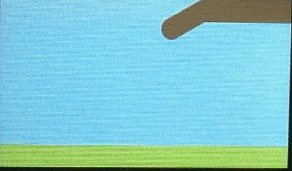
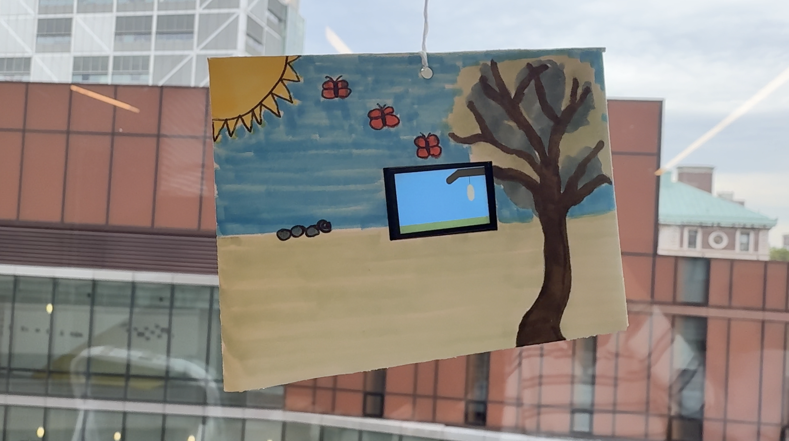

# Transitions: Caterpillar to Butterfly

This is a caterpillar to butterfly animation I made for the ESP32 TTGO T-Display, for our Module 1 "Transitions" installation in COMS BC 3930. A caterpillar crawls in, turns into a chrysalis, and then comes out as a orange butterfly and flies away, on a loop.

**Blog post:** [add link here]



## Design goals

- I wanted to show transitions with one transformation everyone already knows, so it makes sense without any explanation: caterpillar, chrysalis, butterfly.
- I wanted to keep the code and design simple on purpose. It's just circles, ellipses, lines, and a frame counter, so I could understand and work on it as a beginner.
- The change shows up in color and shape, not just movement. The chrysalis goes from green to dark brown and the wings open and close as well.
- I made the loop seamless so there's no hard cut. The butterfly flies off the top of the screen and the next caterpillar crawls in from the left.

## Installation



I hung my device in a small paper envelope, running off a battery, for the class installation on 10/1. The design on the small envelope reflects my animations and continues the story. I wanted it to feel continuous in a sense. 

## Hardware

- ESP32 TTGO T-Display (135x240 screen)
- 1000 mAh Lithium rechargeable battery
- USB cable (for uploading the code)
- Small paper envelope (for hanging it in the installation)
- Popsicle stick (for hanging it in the installation)
- String (for hanging it in the installation)

## Software

- Arduino IDE with ESP32 board support installed
- [TFT_eSPI](https://github.com/Bodmer/TFT_eSPI) library (install from Sketch > Include Library > Manage Libraries)

## Setup

1. Install the TFT_eSPI library.
2. Tell TFT_eSPI which screen you have. In the library folder, open `User_Setup_Select.h`, comment out the line `#include <User_Setup.h>`, and uncomment the line `#include <User_Setups/Setup25_TTGO_T_Display.h>`. Save the file.
3. Open `stages-of-butterfly/stages-of-butterfly.ino` in Arduino IDE.
4. Under Tools, choose the board ESP32 Dev Module and the port your board appears on.
5. Click Upload.
6. The animation starts right away. If it looks upside down, change `tft.setRotation(1)` to `tft.setRotation(3)`.
7. To run it without a cable, unplug the USB and connect the Lithium battery. Check that the wire colors match the markings on the board's battery connector.

## How it works

A counter called `frame` goes up by 1 every time `loop()` runs. Each frame, the whole scene is redrawn on a hidden canvas (a TFT_eSPI "sprite") and then sent to the screen all at once, which stops flickering.

| Frames | Stage | What happens |
| --- | --- | --- |
| 0 to 299 | Caterpillar | Four green circles crawl in from the left, bobbing up and down |
| 300 to 599 | Chrysalis | A shape hangs from the branch, green at first, then dark brown |
| 600 to 899 | Butterfly | Orange wings open and close while it flies up and to the left, off the screen |

At frame 900 the counter resets to 0 and the story repeats. One full loop takes about 30 seconds.

## What you can Customize

- **Colors:** each color is a `tft.color565(red, green, blue)` call with values from 0 to 255.
- **Speed:** change the `delay(20)` at the bottom of `loop()`. A smaller number is faster.
- **Flap speed:** change the numbers in `frame % 16 < 8`.
- **Chrysalis position:** change `chrysalisX` and `chrysalisY` at the top.

## Files

```
stages-of-butterfly/
  stages-of-butterfly.ino
media/
  demo.gif
  installation.jpg
README.md
```

## References and acknowledgments

- [TFT_eSPI](https://github.com/Bodmer/TFT_eSPI) by Bodmer, used to draw to the T-Display screen.
- Made by Arisha Lari for COMS BC 3930 at Barnard College, Fall 2026.
